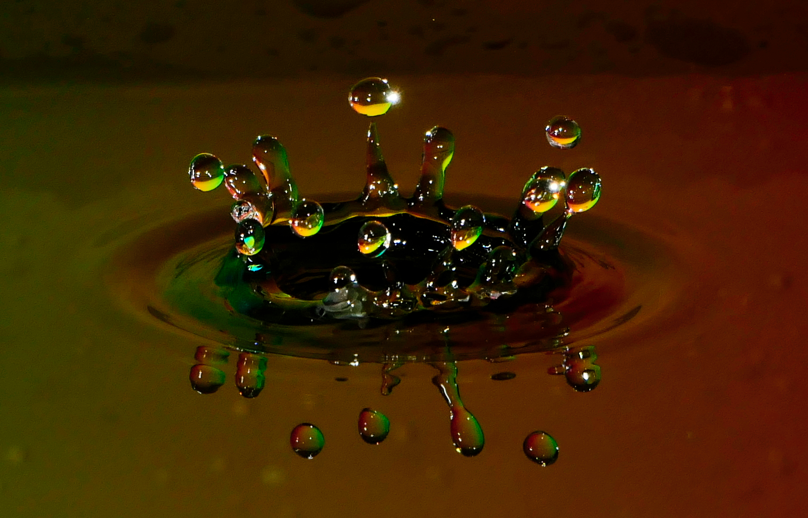

# Water Drop Photography

 


We will use a Raspberry Pi and a Lumix camera to take photos of waterdrops on a water surface.

## What did we use?

- Raspberry Pi 3
- Photo resistor module
- diode laser
- jumper wires
- Lumix FZ 1000
- bassin
- board of a bookshelf
- 2 small cartons
- syringe 

## Construction


## Wiring

For the code the photo resistor module is connected to GPIO 23 (Pin 16). For the photo resistor and the laser you need a 3,3V power supply. Therefore you can connect it to Pin 1 (+3,3V) and 6 (Ground) and Pin 17 (+3,3V) and 20 (Ground).


## Usage

Install the code on the Raspberry Pi and start it with 
```
sudo python waterdrop.py
```
You are asked how much time will be waited until the camera gets a capture command. A usfull period of time depends on the height of the light barrier and the size of the water drops.

## Disclaimer

This is a private project. I share the files to help others who want to do something similar. Although I have done this project to the best of my ability, I cannot guarantee that the software will work. Downloading and using is at your own risk.

## Feedback

I am grateful for feedback, bugs and feature requests. I will incorporate them into the project if necessary. If you want to extend the functionality or don't want to wait for me, feel free to fork this project.

## Contribution

The usage and implementation of the Photoelectric sensor is inspired by https://tutorials-raspberrypi.de/infrarot-lichtschranke-bauen-und-geschwindigkeit-messen/.

